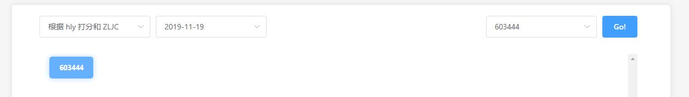

# 基于成交量的股票数据分析系统
## Quant On Volume

`Github`: [https://github.com/CatsJuice/quant-on-volume](https://github.com/CatsJuice/quant-on-volume)

- [1. 数据获取](#1-数据获取)
    - [1.1. 实验环境搭建](#11-实验环境搭建)
    - [1.2. 抓取数据](#12-抓取数据)
        - [1.2.1. 新浪财经](#121-新浪财经)
            - [1.2.1.1. 抓取所有股票代码](#1211-抓取所有股票代码)
            - [1.2.1.2. 抓取日线数据](#1212-抓取日线数据)
        - [1.2.2. 网易财经](#122-网易财经)
            - [1.2.2.1 获取所有股票代码](#1221-获取所有股票代码)
            - [1.2.2.2. 获取日线数据](#1222-获取日线数据)
        - [1.2.3. 东方财富](#123-东方财富)
            - [1.2.3.1.  获取所有股票代码](#1231--获取所有股票代码)
            - [1.2.3.2.  获取日线数据](#1232--获取日线数据)
        - [1.2.4. TuShare (挖地兔)](#124-tushare-挖地兔)
            - [1.2.4.1. 概述](#1241-概述)
            - [1.2.4.2. 基本使用](#1242-基本使用)
        - [1.2.5. 其他平台](#125-其他平台)
            - [1.2.5.1. W.ind](#1251-wind)
            - [1.2.5.2. 优矿](#1252-优矿)
    - [1.3. 数据获取总结](#13-数据获取总结)
        - [1.3.1. 股票代码抓取的总结](#131-股票代码抓取的总结)
        - [1.3.2. 日线数据抓取总结](#132-日线数据抓取总结)
        - [1.3.3. 反爬虫策略及解决的总结](#133-反爬虫策略及解决的总结)
- [2. 数据清洗（数据预处理）](#2-数据清洗数据预处理)
    - [2.1. 无效数据处理](#21-无效数据处理)
    - [2.2. 缺失数据处理](#22-缺失数据处理)
- [3. 数据分析](#3-数据分析)
    - [3.1. 《胡立阳股票投资100招》 由“价量关系”来为个股打分 （一）](#31-胡立阳股票投资100招-由价量关系来为个股打分-一)
        - [3.1.1. 介绍](#311-介绍)
        - [3.1.2. 思路分析](#312-思路分析)
        - [3.1.3. 实现](#313-实现)
        - [3.1.4. 运行结果](#314-运行结果)
        - [3.1.5. 结果分析](#315-结果分析)
    - [3.2. 《胡立阳股票投资100招》 由“价量关系”来为个股打分 （二）](#32-胡立阳股票投资100招-由价量关系来为个股打分-二)
        - [3.2.1. 思路分析](#321-思路分析)
        - [3.2.2. 实现](#322-实现)
        - [3.2.3. 分析结果](#323-分析结果)
    - [3.3. 主力进出 (ZLJC) (一)](#33-主力进出-zljc-一)
        - [3.3.1. 概念](#331-概念)
        - [3.3.2. 思路分析](#332-思路分析)
        - [3.3.3. 实现](#333-实现)
            - [3.3.3.1. ZLJC 的计算](#3331-zljc-的计算)
            - [3.3.3.2. 代码编写](#3332-代码编写)
            - [3.3.3.3. 结果校验](#3333-结果校验)
    - [3.4. 主力进出 (ZLJC) (二)](#34-主力进出-zljc-二)
        - [3.4.1. 前提引入](#341-前提引入)
        - [3.4.2. 主要问题及分析思路](#342-主要问题及分析思路)
        - [3.4.3. 代码编写](#343-代码编写)
        - [3.4.4. 结果分析](#344-结果分析)
    - [3.5. 综合应用](#35-综合应用)
        - [3.5.1. 数据准备](#351-数据准备)
        - [3.5.2. 实现](#352-实现)
        - [3.5.3. 统计结果分析](#353-统计结果分析)
- [4. 优化方案](#4-优化方案)
    - [4.1. 爬虫性能优化](#41-爬虫性能优化)
    - [4.2. 数据读取效率优化](#42-数据读取效率优化)
    - [4.3. 编程模式的优化](#43-编程模式的优化)
- [5. 总结](#5-总结)


# 1. 数据获取

## 1.1. 实验环境搭建

系统及使用的语言：

> Windows 10 专业版 1903 操作系统版本： 18362.356
> 
> Python 3.7.3 64-bit

需要额外安装的库：

> virtualenv-16.6.0： `pip install virtualenv`

> requests-2.22.0： `pip install requests`
>
> 所依赖的模块：`URLlib3` 在安装 `requests` 时会自动`安装
`尝试切换页面， 查看地址栏 URL 的变化
> BeautifulSoup4-4`.8.`, 未发生改变ip install BeautifulSoup4`

> pandas: `pip install pandas`
>
> 所依赖的模块：`pytz` ,`numpy`, `python-dateutil`, `six`, 在安装 `requests` 时会自动安装

> tqdm-4.36.1: `pip install tqdm`

## 1.2. 抓取数据

> 数据的抓取是构建数据仓库的第一步，首先需要确定数据来源，这个过程通常需要比较各个数据平台，考核数据平台的数据与研究需求的符合程度；具体表现在以下方面：
> - 数据的**可靠性**
>   - 指数据来源是否可靠，有无数据敏感等潜在问题
> - 数据的**完整性**
>   - 指与需求所需的数据相比是否有所缺失
>   - 数据是否齐全
> - 获取的**难易度**
>   - 抓取过程的实现难度

在本选题中，对数据的需求主要是**成交量**, 而成交量又分为**分时数据**(单位时间为一交易日中的若干分钟)和**分日数据**(单位时间为一个交易日)，分时数据的数据量较为庞大，在这里，主要还是针对分日数据进行研究，由于股市的特殊性， 单一的成交量很难制定出可能有效的策略，所以在研究过程中，依旧需要其他的数据作为辅助，综上所述， 在数据抓取阶段，主要需要抓取的数据是：
- 股票代码列表
- 日线数据

### 1.2.1. 新浪财经

#### 1.2.1.1. 抓取所有股票代码

进入新浪财经官网进行查找， 可以在

```bash
行情中心首页 > 沪深股市 > 排行 > A股成交额
```

找到成交额的排行耪， 这里可以获取到所有沪深A股的股票代码; 链接地址如下：

> [http://vip.stock.finance.sina.com.cn/mkt/#stock_hs_amount](http://vip.stock.finance.sina.com.cn/mkt/#stock_hs_amount)

**分析页面**

首先可以看到请求的 url 中有 `#` 字符，使用了 `hash` 路由, 初步判断页面使用前端框架加打包工具构建， 数据很可能是异步加载的；

尝试跳转下一页， 页面的 `url` 没有发生变化（并未出现page或相应页码等关键字）, 所以通过调试工具（F12打开开发者工具）, 切换到 网络（`Network`）栏， 只查看 `XHR` ( `XMLHttpRequest` ), 此时在跳转页码时， 会通过 `GET` 请求获取数据， 分析请求的 `url` 如下:

```bash
https://vip.stock.finance.sina.com.cn/quotes_service/api/json_v2.php/Market_Center.getHQNodeData?page=3&num=40&sort=amount&asc=0&node=hs_a&symbol=&_s_r_a=

```

在其中最为关键的数据即是 `page` 的值，而其返回的数据格式为喜闻乐见的 `json`，至此抓取的准备工作全部完毕， 可以进行抓取，在抓取的时候需要注意的是预防因并发过高导致本机 `ip` 被封锁， 关于这一点的预防手段在  作详述；

**数据抓取**

在浏览器中直接访问链接可以请求到数据内容， 查看页面编码为 `GBK` ,直接使用 `requests` 模块通过 `GET` 请求页面，初步抓取到数据， 尝试直接使用 `json.loads()` 将字符串转为字典发生错误， 这里对获取的字符串进行分析，其基本格式如下：

```json
[
    {symbol:"sh600519",code:"600519",name:"贵州茅台",trade:"1178.580", ...},
    ...
]
```

关键在于其格式不符合 `json` 的基本格式， 这种格式在 `JavaScript` 中作为对象可以解析， 但对 `json` 来说是不合法的；尝试使用 `eval()` / `ast.literal_eval()` 来替代 `json`, 同样无法直接解析， 所以需要更改思路， 手动更改字符串的格式， 给字典的键添加双引号， 编写正则替换方法如下：

```py
def json_format(self, str):
    import re
    str = re.sub(u'{([^{:]*):', u'{"\\1":', str)
    str = re.sub(u',([^,:{]*):', u',"\\1":', str)
    str = str.replace(' ', '')
    return str
```

#### 1.2.1.2. 抓取日线数据

在新浪财经数据中心， 我并没有找到**交易数据**的表格, 要获取某只股票的 `日线` / `分线`的数据只能通过点击某只股票进入其[详情界面](https://finance.sina.com.cn/realstock/company/sh601789/nc.shtml)(同时，url中的股票代码对应相应的股票), 在详情页中，新浪财经的数据并非以表格的形式展示， 而是通过图表展示， 鼠标移过(`hover`)时更新当前股票的数据信息;其样式如下图所示：


初步判断新浪财经应该是使用了类似 [ECharts](https://www.echartsjs.com/zh/option-gl.html#globe) 的数据可视化库，即通过 `canvas` 绘制，这对网络爬虫是及其不友好的，无法直接从网页的结构中获取数据；

所以更改思路，分析 `js` 源码, 找到鼠标移动时的监听事件，这一过程主要是为了：

+ 查明 JS 如何更新数据
+ JS 从哪里获取数据

首先， 通过页面元素审查可以发现， 分时线是通过`HTML5`的`canvas`绘制的， 在`Sources`找相关的`js`文件， 可以找到`paintSth.js`文件， 由于在鼠标移动时会更新页面元素， 所以可以直接在文件中查找 `mousemove`， 找到了相关代码如下:

```js
C = this.interactCanvas,
...
...
...
C.addEventListener("mousemove", o),
```

**需要注意的是**，我们可以获取到的 js 源码一般都是经过 `webpack` 之类的工具打包的，通常打包后的代码，可读性会变差，主要表现在：
- 代码量增多
  + 解决设备兼容性
  + 编译预处理语言
  + ES6、ES7的向下兼容
  + ...
- 注释的丢失
- 代码缩进
- 打包工具对原命名的处理

在这里，代码可读性可以说是比较友好的， 可以看到`canvas`加了一个`mousemove`的监听器， 执行`o`, 再查找`o()`, 可以找到如下代码：

```js
function o() {
    if (!c) {
        var t = document.createElement("canvas");
        c = t.getContext("2d")
    }
    return c
}
```
但这里 `c` 又是一个未知量， 所以应该继续检索 `c` 的信息， 由于关联的js文件较多， 这种做法过于费时费力， 爬取新浪财经的交易数据应该不是明智的选择；

**换种思路**， 可以使用全能的 `Selenium` (`+` `PhentomJS`), `Selenium` 是一个自动化脚本工具， 而 `PhentomJS` 是一个无界面浏览器,在有图形界面的环境下， 可以只使用 `Selenium` (但图形界面的渲染难免会造成性能上的差距);
通过 `selenium`, 让鼠标在固定位置移动， 同时抓取更新的信息， 这种做法是可行的, 而我也尝试了这一方法，可以抓取到数据， 但是存在的问题是：

- 效率低，耗时久
- 由于鼠标移动的像素原因，可能出现数据遗漏
- 默认显示的数据范围不确定，即无法控制刷子（`brush`, 术语来自 Echarts 的配置项， 即控制显示区域的滑块）

### 1.2.2. 网易财经

#### 1.2.2.1 获取所有股票代码

网易财经的所有 **沪深A股** 数据位于

> http://quotes.money.163.com/old/#query=EQA&DataType=HS_RANK&sort=PERCENT&order=desc&count=24&page=0
> 

从 `url` 来看， 换页通过 `url` 传参来实现， 但是实际操作可以发现， 点击换页时 `url` 中的 `page` 并不会改变， 尝试改变 `url` 中的 `page` 参数， 当前页面仍未改变，仔细看可以看到 `url` 中带有显式的 `#`, 可见是有前端的 `hash` 路由, 判断所有数据是异步加载的， 这就意味着无法像 [1.2.1. 新浪财经](#121-新浪财经) 中爬取新浪财经一样， 枚举 `url` 的 `page` 参数来爬取所有信息；

对于**网易财经**，由于点击换页时页面的 `url` 没有更新，所以应该是使用了 `Ajax` 来异步更新数据， 通过`F12`调起开发者工具， 在 `Network` 选型卡中， 筛选 `XHR` (`XMLHttpRequest`), 每当点击换页时， 就会有新的 `XHR`， 分析这些 `XHR` 的 `url` 如下，可以发现，只有 `page` 值在改变：


可以看到请求方法（Request Method）为 `GET`, 所以可以直接复制 `Request URL` 并使用浏览器访问， 可以得到 `json` 格式的数据， 但是中文通过 `Unicode` 编码了， 在获取后， 可以通过(`python`) `s.decode('unicode_escape')` 来解码；接下来就是对 `json` 解析并提取需要的信息了， `json` 格式如下：


&emsp;&emsp;在 `list` 中有`[0]`到`[23]`共`24`条数据， 对应请求中的参数 `count=24`， 关于字段名的解释， 以下为我的分析：

|  No.  |  key_name   |                           meaning                            |
| :---: | :---------: | :----------------------------------------------------------: |
|   1   |  ANNOUNMT   | 公告信息，并非必须，对应在页面中有公告标签的股票才有这个字段 |
|   2   |    CODE     |                           股票代码                           |
|   3   | FIVE_MINUTE |                         5分钟涨跌额                          |
|   4   |    HIGH     |                             最高                             |
|   5   |     HS      |                        换手率(不带%)                         |
|   6   |     LB      |                             量比                             |
|   7   |     LOW     |                             最低                             |
|   8   |    MCAP     |                           流通市值                           |
|   9   |   MFRATIO   |    list, 包含2个值`MFRATIO2`:净利润， `MFRATIO10`: 主营收    |
|  10   |    MFSUM    |                           每股收益                           |
|  11   |    NAME     |                             名称                             |
|  12   |     NO      |                       网易财经中的编号                       |
|  13   |    OPEN     |                           今日开盘                           |
|  14   |     PE      |                            市盈率                            |
|  15   |   PERCENT   |                            涨跌幅                            |
|  16   |    PRICE    |                             价格                             |
|  17   |    TCAP     |                            总市值                            |
|  18   |  TURNOVER   |                            成交额                            |
|  19   |   VOLUME    |                            成交量                            |
|  20   |     WB      |                             委比                             |

&emsp;&emsp;所以可以直接抓取这个url来获取相关的数据， 更有趣的是， 请求参数中有个`count`参数， 决定了数据的数量， 所以我尝试将`count`设置成全部数量, 查看网易财经沪深A股， 网易的编号最后一只为`3607`， 所以如下请求：

```js
'http://quotes.money.163.com/hs/service/diyrank.php?host=http%3A%2F%2Fquotes.money.163.com%2Fhs%2Fservice%2Fdiyrank.php&page=0&query=STYPE%3AEQA&fields=NO%2CSYMBOL%2CNAME%2CPRICE%2CPERCENT%2CUPDOWN%2CFIVE_MINUTE%2COPEN%2CYESTCLOSE%2CHIGH%2CLOW%2CVOLUME%2CTURNOVER%2CHS%2CLB%2CWB%2CZF%2CPE%2CMCAP%2CTCAP%2CMFSUM%2CMFRATIO.MFRATIO2%2CMFRATIO.MFRATIO10%2CSNAME%2CCODE%2CANNOUNMT%2CUVSNEWS&sort=PERCENT&order=desc&count=3607&type=query'
```

即可返回所有json格式的数据， 然后再进行解析， 并写入文件， 完整代码不在这里赘述。

#### 1.2.2.2. 获取日线数据

网易财经的日线交易数据位于：

> [http://quotes.money.163.com/trade/lsjysj_601318.html#06f01](http://quotes.money.163.com/trade/lsjysj_601318.html#06f01)

URL 中的 `601318` 对应为股票的代码， 打开页面分析页面内容， 在这个页面没有换页按钮， 仅显示若干条数据， 但是在数据表的右上角有个下载数据的链接， 点击后， 需要勾选需要下载的字段， 点击下载后会下载一个 `[code].csv` 文件， 所以要做的就是抓取下载的真实 `URL`, 按  `F12` 打开开发者工具， 点击下载按钮后， 在控制台看到如下提示：


这里已经暴漏了真实的下载地址，即：

> http://quotes.money.163.com/service/chddata.html?code=0601318&start=20070301&end=20191122&fields=TCLOSE;HIGH;LOW;TOPEN;LCLOSE;CHG;PCHG;TURNOVER;VOTURNOVER;VATURNOVER;TCAP;MCAP

而想要搞清楚 `URL` 的参数， 可以转到执行 `submit` 的文件， 这里即 `b.667271.min.js:1` , 这是一个工程化代码缩进后的 `js` 文件， 通过格式化工具格式化后， 在最后可以找到如下关键代码：

```js
submit: function() {
    var e = n.value;
    if (e) e = e.replace(/-/g, "");
    var a = i.value;
    if (a) a = a.replace(/-/g, "");
    var o = t.elem.getElementsByTagName("input"),
    r = [];
    for (var d = 0; d < o.length; d++) {
        if (o[d].type == "checkbox" && o[d].checked) {
            r.push(o[d].value)
        }
    }
    var c = "/service/chddata.html?code=" + window["STOCKCODE"];
    e && /^\d{8}$/.test(e) && (c += "&start=" + e);
    a && /^\d{8}$/.test(a) && (c += "&end=" + a);
    r.length && (c += "&fields=" + r.join(";"));
    location.href = c
}
```

能够清楚地看到url的拼接过程， 具体参数如下

|  No.  |  param   |    meaning     |                                                                               rule                                                                                |
| :---: | :------: | :------------: | :---------------------------------------------------------------------------------------------------------------------------------------------------------------: |
|   1   | `start`  |    起始日期    |                                                      年月日直接拼接，如`20191027`，月份及日期不足`2`位补`0`                                                       |
|   2   |  `end`   |    截止日期    |                                                      年月日直接拼接，如`20191027`，月份及日期不足`2`位补`0`                                                       |
|   3   | `fields` | 需要下载的字段 |                        使用 `;`分割，如：`TCLOSE;HIGH;LOW;TOPEN;LCLOSE;CHG;PCHG;TURNOVER;VOTURNOVER;VATURNOVER;TCAP;MCAP` 具体意义不作详述                        |
|   4   |  `code`  |    股票代码    | 关于股票代码， 网易财经的股票代码在传参时， 如果是以 `6` 开头的股票， 需要在前面加 `0`, 而以`0`和`3`开头的股票需要在前面加`1`,如：`1000333`, `1300001`, `0601318` |

接下来是做抓取， 抓取就是根据已经获取的股票代码， `枚举股票代码`并下载对应的日线数据， 仅需注意每次循环最好使用 `time.sleep(random.random()*2)`， 否则可能因操作频繁被拒绝访问

### 1.2.3. 东方财富

#### 1.2.3.1.  获取所有股票代码

在东方财富网站中，我没有找到合适的页面，但在[实时资金流向排行](http://data.eastmoney.com/zjlx/detail.html)中可以看到约 `3800` 只股票的数据

还是通过常规方法测试该页面，初步测试的情况如下：

- 查看 `URL` 没有发现带有页码的参数
- 尝试切换页面， 查看地址栏 `URL`, 未发生改变
- 尝试切换页面， 抓取 `XHR`, 并没有 `XHR`

这种情况比较少见，即不是通过 `URL` 传参来获取，所以在换页时， 尝试抓取 `XHR` 之外的请求,结果如下：


看到请求方法是 `GET`, 尝试直接使用浏览器访问，无法访问， 尝试使用 `Postman` 接口测试工具来请求：


判断 东方财富应该是设置了反爬虫的策略， 又或者是其工程化工具对 `.gif` 的特殊解析，抓取数据实现较为困难。

#### 1.2.3.2.  获取日线数据

东方财富的日线数据的表现形式与新浪财经相同， 均采用了数据可视化的框架，数据以 动态的 `canvas` 呈现, 如下图所示：


东方财富的交易数据地址：[http://quote.eastmoney.com/sh600175.html](http://quote.eastmoney.com/sh600175.html)(路径中的`600175` 对应相应的股票代码)；

和新浪财经一样，这种展现形式对网络爬虫是极其不友好的，无法直接从网页的元素中解析出数据，数据通过 `canvas` 绘制, 想要获取数据，正确的思路应该是获取渲染数据的来源，即从可视化框架的配置项的配置过程中自底向上寻找数据来源。执行如下步骤：

- 刷新页面，抓取 `XHR`: 仅有 `3` 个无关 `XHR`
- 刷新页面，抓取 `JS`: 有大量的 `JS` , 逐个检查其 `Preview`:
  - 首先可以找到**分时数据**的请求源, 对应上面的第一个 `canvas` ，数据格式如下：
  - 
  - 但本研究的数据需求重心在于日线数据，所以继续检查 `js` 请求，很快就能找到请求`response`如下的 `JS`： 
  - 
  - 这正是需要的数据，查看 `Headers` 来确定请求的方式，请求方式为 `GET` , 其 `Request URL` 为:
  - > [http://pdfm.eastmoney.com/EM_UBG_PDTI_Fast/api/js?rtntype=5&token=4f1862fc3b5e77c150a2b985b12db0fd&cb=jQuery112409397171122443517_1574509941395&id=6001751&type=k&authorityType=&_=1574509941411](http://pdfm.eastmoney.com/EM_UBG_PDTI_Fast/api/js?rtntype=5&token=4f1862fc3b5e77c150a2b985b12db0fd&cb=jQuery112409397171122443517_1574509941395&id=6001751&type=k&authorityType=&_=1574509941411)
  - 使用 `Postman` 解析参数如下：

|  No.  |      param      |                    value                    |
| :---: | :-------------: | :-----------------------------------------: |
|   1   |    `rtntype`    |                     `5`                     |
|   2   |     `token`     |     `4f1862fc3b5e77c150a2b985b12db0fd`      |
|   3   |      `cb`       | `jQuery112409397171122443517_1574509941395` |
|   4   |      `id`       |                  `6001751`                  |
|   5   |     `type`      |                     `k`                     |
|   6   | `authorityType` |                 `undefined`                 |
|   7   |       `_`       |               `1574509941411`               |

直接使用浏览器请求该 `URL` 可以直接获取到数据， 使用 `Postman` 测试也能抓取到数据， 尝试改变参数中的 `id` 值，即更改股票代码获取日线数据时， 发现同样可以获取到数据，但数据格式上， 东方财富的数据格式可读性可以说是非常差， 其储存方式为一维数组，单日的数据以字符串的形式存储， 不同的参数间用逗号分隔， 示例如下：

```js
"data": [
    "1994-04-05,19.45,19.70,20.20,17.80,24484,46657000,12.07%,28.8",
    ...
    "2019-11-22,7.12,7.09,7.23,7.06,20841,14859296,2.4%,0.28"
]
```
这里只能手动去比较东方财富数据可视化的 `canvas` 中反馈的数据字段名了, 结果对照如下：

| 数组下标 |    示例值    | 字段名 |
| :------: | :----------: | :----: |
|    0     | `2019-11-22` |  日期  |
|    1     |    `7.12`    |  开盘  |
|    2     |    `7.09`    |  收盘  |
|    3     |    `7.23`    |  最高  |
|    4     |    `7.06`    |  最低  |
|    5     |   `20841`    | 成交量 |
|    6     |  `14859296`  | 成交额 |
|    7     |    `2.4%`    |  振幅  |
|    8     |    `0.28`    |   /    |

接下来最大的问题就是能否频繁抓取的问题了，这里让我特别在意的是 `URL` 中的 `token` 和 `cb` , 一般来说， `token` 是作为一个验证项， 通常会进行加密， 并且具有时效性，如果东方财富同样进行了这样的处理， 那么数据抓取就会有大幅的难度, 而 `cb` 乍一看看不出其实际意义， 但其 `value` 为复杂的字符串, 初步判断也是进行权限验证的, 在一定时间内或一定请求频率内， `token` 和 `cb` 是不会失效的， 这意味着有通过接口直接爬取的可能, 而如果这个方式行不通， 那么就需要知道 `token` 和 `cb` 的前端计算方式，从而进行数据抓取。

- 直接在 `source` 中搜索 `token` 来查找，可以找到 `token` 的定义如下:
- 
- 但在搜索 `cb` 时却无法搜索到相关处理
- 尝试更改 `cb` 的值进行请求，可以发现，`cb` 其实是前端接收数据时调用的方法名，具体来说， 东方财富请求数据是通过 `jsonp` 来处理跨域，那么 `cb` 即指定回调函数的函数名， 所以 `cb` 实际上是 `callBack` 的缩写
- 尝试使用 `request URL` 直接抓取, 发现有可能收到数据如下：
```js
    jQuery1124036208821942748104_1574562443091({stats:false})
```
- 编写爬虫代码，尝试抓取单只股票， 成功抓取到，但尝试抓取全部，可能会因无法获取被中断，看来是东方财富在反爬虫上确实下了功夫。

> 如果以上方法行不通，那么考虑的方向则是动态抓包获取 `token` 和 `cb`, 需要考虑 `scapy`、`pypcap`、`pkdt`等工具；

### 1.2.4. TuShare (挖地兔)

#### 1.2.4.1. 概述

TuShare 是一个免费开源的第三方数据平台，以下是官方介绍：

> `Tushare`是一个`免费`、`开源`的 `python` 财经数据接口包。主要实现对股票等金融数据从**数据采集**、**清洗加工** 到**数据存储**的过程，能够为金融分析人员提供快速、整洁、和多样的便于分析的数据，为他们在数据获取方面极大地减轻工作量，使他们更加专注于策略和模型的研究与实现上。

**接口文档地址**：[http://tushare.org/](http://tushare.org/)

**ToShare Pro**: [https://tushare.pro/](https://tushare.pro/)

#### 1.2.4.2. 基本使用

**环境依赖**

- Python 2/3 (`Python 2.7 will reach the end of its life on January 1st, 2020`)
- Pandas
- lxml

**安装**

- 方式1：`pip install tushare`
- 方式2：访问[https://pypi.python.org/pypi/Tushare/](https://pypi.python.org/pypi/Tushare/)下载安装

**使用**

以[历史行情接口](http://tushare.org/trading.html#id2)为例，如下使用：

```py
import tushare as ts

ts.get_hist_data('600848')      #一次性获取全部日k线数据
```

返回数据如下：


### 1.2.5. 其他平台

#### 1.2.5.1. W.ind

官网: [https://www.wind.com.cn/Default.html](https://www.wind.com.cn/Default.html)

> 中国市场的精准金融数据服务供应商，为量化投资与各类金融业务系统提供准确、及时、完整的落地数据，内容涵盖 股票、债券、基金、衍生品、指数、宏观行业等各类金融市场数据，助您运筹帷幄，决胜千里

#### 1.2.5.2. 优矿

官网: [https://uqer.io/](https://uqer.io/)

> 提供各类资产的财务、因子、主题、宏观行业特色大数据，以及量化场景下的PIT数据，保障量化过程不引入未来数据。 股票、期货、指数、场内外基金等多资产多策略回测。丰富的衍生工具，保证多因子策略、事件驱动等快速实现。

## 1.3. 数据获取总结

综合上述的数据平台， 主要分为两类，一类是新浪、网易、东方财富这样的面向大众的数据平台，另一类是面向有数据需求的集成好的数据；

关于 2 类数据的优劣，简单来说前者数据不容易找，抓取困难，后者数据较全，但往往需要付费才能享受这一优势，接口调用的频率有限制，无法通过代理等手段绕过其反爬策略;

具体数据抓取结果如下：

### 1.3.1. 股票代码抓取的总结

| 序号  | 平台名称 | 数据完整性 | 平台可能使用的反爬策略                                                           | 主要困难                                                          | 爬取思路                                                                                                          |
| :---: | :------: | :--------: | :------------------------------------------------------------------------------- | :---------------------------------------------------------------- | :---------------------------------------------------------------------------------------------------------------- |
|   1   | 新浪财经 |    完善    | 1. 数据异步加载                                                                  | 抓取的 `XHR` 的返回结果非合法的 `json` 格式导致 `python` 无法解析 | 正则替换                                                                                                          |
|   2   | 网易财经 |    完善    | 1. 数据异步加载<br>2. 接口调用频率的限制                                         | 请求接口的频率受限                                                | 1. 网易财经的接口中的 `count` 决定返回的数据量，所以可以直接设置成极限值<br> 2. 降低请求频率 <br>3. 使用`代理 IP` |
|   3   | 东方财富 |    完善    | 1. 数据异步加载，且并非通过 `XHR`, 而是 `.gif`, 据我判断应该是使用了自定义的解析 | 无法找到接口                                                      | **比较难以实现**                                                                                                  |
|   4   | tuShare  |    完善    | 1. 请求频率的限制                                                                | 平台通过 `token` 来标识用户，即使是代理 IP 也无法绕过其反爬虫策略 | 1. **以较低的频率获取**<br>2. 成为平台会员                                                                        |


### 1.3.2. 日线数据抓取总结

| 序号  | 平台名称 | 数据完整性 | 平台可能使用的反爬策略                                        | 主要困难                                                          | 爬取思路                                   |
| :---: | :------: | :--------: | :------------------------------------------------------------ | :---------------------------------------------------------------- | :----------------------------------------- |
|   1   | 新浪财经 |  无法验证  | 1. 使用 `canvas` 展现数据<br>2. 不通过 XHR/JS 来加载数据      | 无法找到显式的请求返回值                                          | **比较难以实现抓取**                       |
|   2   | 网易财经 | 有少量缺失 | 1. 下载接口调用频率有限                                       | 寻找网易财经的最终数据接口，突破请求频率的限制                    | 代理 IP 的使用                             |
|   3   | 东方财富 |    完整    | 1. 使用 `canvas` 展现数据<br> 2.获取数据的接口有 `token` 验证 | 接口的 `token` 验证                                               | 使用 `scapy` / `pypcap & pkdt` 抓包        |
|   4   | TuShare  |    完整    | 1. 请求频率的限制                                             | 平台通过 `token` 来标识用户，即使是代理 IP 也无法绕过其反爬虫策略 | 1. **以较低的频率获取**<br>2. 成为平台会员 |

### 1.3.3. 反爬虫策略及解决的总结

| 序号  |   策略简述   |                        策略详述                         |                      应对措施                       |
| :---: | :----------: | :-----------------------------------------------------: | :-------------------------------------------------: |
|   1   |   IP 封锁    |    对单一 IP 的高并发 / 高频率操作，限制该 IP 的操作    |        1. 降低操作的频率；<br>2. 使用代理 IP        |
|   2   |   UA 封锁    |               对显式的爬虫请求头进行封锁                |                 设置请求头进行请求                  |
|   3   | cookie 验证  |          部分网站需要携带 cookie 才能请求数据           |        使用浏览器进行登陆等操作获取 `cookie`        |
|   4   |  验证码验证  |       当一定条件时，触发验证码验证， 导致爬取阻塞       |                   降低爬取的频率                    |
|   5   | JS 加载数据  |                    使用 js 加载数据                     |             使用抓包获取加载数据的来源              |
|   6   | XHR 加载数据 | 通过 Ajax 请求获取数据， 数据不能直接从页面元素内解析出 | 使用抓包获取接口的 `Request URL` / `Methods` 及参数 |


# 2. 数据清洗（数据预处理）

> **数据清洗**（`Data Cleaning`）是指发现并纠正数据文件中可识别的错误的最后一道程序，包括检查数据一致性，处理无效值和缺失值等；
数据清洗的重点是**一致性检查**（`Consistency Check`），即根据每个变量的合理取值范围和相互关系，检查数据是否合乎要求，发现超出正常范围，逻辑上不合理或相互矛盾的数据。
> 由于调查，编码和录入误差，数据中可能存在一些无效值和缺失值，常用的处理方法有：估算，整例删除，删除变量状语从句：成对删除；
> 数据清洗的主要类型有：**残缺数据**，**错误数据**，**重复数据**；

在抓取完数据后，无法保证数据的完整性及有效性，具体来说可能有如下情况：

1. 某项数据为空
   - 目标数据的某一字段的某个值可能存在为空的情况
2. 某项数据数据类型错误
   - 目标数据的某一字段的某个值可能与预期数据类型不符， 如成交量的数据为 `None` 等无法转换为数字的字符串
3. 某单一股票的数据不全
   - 如果某一股票在过去已退市， 而在抓取的时候可能也会抓取到，对这些数据应该做出正确的处理

## 2.1. 无效数据处理

首先， 简单打开若干个日线数据文件， 可以发现存在不少无效的数据（全部为 0），这些数据如果不经过处理， 会使后面的数据分析出现较大的误差，如何**处理缺失数据**是这一步的重中之重。

对常规的数据清洗，如果某个值出现缺失，可能执行的操作是删除整行 ( `Series` in `pandas` )或根据前后数据计算出近似的数据，但在本研究中，无论是删除某一行的数据或是进行计算， 都是不合理的。

以抓取的日线数据为例，如果删除所有无效的行，即某只股票某一天的交易数据， 那么必然导致分析的时候有所误差，而且误差会很大，例如 `MA` 等值的计算会受到一定影响，而模拟交易也会变得不真实。如果不删除无效的数据，而是通过前后数据计算，这样也是不合理的，因为我们无法确定丢失的那天的数据是否与前后起伏较大，即使相邻两天的数据并非完全无关联，但由于股票的特殊性质，所以完全无法保证丢失的数据会出现突变等意料外的情况。

既然删除数据和计算数据都有较大的误差，所以这里我决定结合多个平台的数据进行清洗，以网易财经的数据为基础，结合 `tushare` 的接口，进行动态的清洗, 程序设计的大致流程如下：


在这一过程的数据清洗中，同时我也在相应的地方进行了埋点统计，从而得出网易财经的数据完整性, 以下数据为 `2014-01-01` 至 `2019-11-11`年的数据清洗埋点统计结果：


可以看到，在共 **`3614`** 只沪深 A 股中，`2014-01-01` 至 `2019-11-11` 网易财经的日线数据有 `247,247` 条（行）无效数据, 涉及的股票数量为 `2803` 只, 约占据全部股票的 `80%`。

## 2.2. 缺失数据处理

对于 `.csv` 格式的数据，在使用 `pandas` 处理时， 空数据并不会解析为空串， 而是 `NaN`(实际上是空，而非字符串)。首先判断是否有数据缺失，依据是只对限定年限后的数据进行统计。

由于 `pandas` 的良好支持， 对二维表的数据查询及操作支持提供了较为完善的 api , 这里贴出核心代码：

```py
def handle_one(self,code):
    ...
    df = df[df['日期'] > "20140101"]
    return df.isna().any().any()    # 1. 转换为 是否是 NaN 的 DataFrame; 2. 返回每列是否有任何一个为 True; 3. 返回 series 是否有 True
```

运行结果如下： 


可以看到，总共有 2 个文件有空值，整个过程耗时约 `39s`， 速度上比手动进行循环判断快很多。 因为只有 2 个文件，这里先手动打开进行验证


手动打开发现两只股票都是数据第一天的部分数据缺失，并不会影响后面的数据分析，在这里进行忽略。


# 3. 数据分析

在完成数据清洗后， 数据仓库正式构建完成， 接下来的重心则是数据的分析，而分析的前提是有明确的分析目的，在这一章节，将以成交量为重心，分析一些成交量主导的投资策略的可行性， 对某些带有参数的投资策略，目的是寻求一个最佳的参数组合。

## 3.1. 《胡立阳股票投资100招》 由“价量关系”来为个股打分 （一）

### 3.1.1. 介绍

> 《胡立阳股票投资100招》是2009年04月经济日报出版社出版的图书，作者是胡立阳。本书主要讲述了胡立阳曾经在口袋只剩27美元的时候，进入美国证券界，在短短三年时间便成为华尔街叱咤风云的人物的故事

该书的第 21 招， 即由“价量关系”来为个股打分，胡立阳在一连串的演讲会中，发现许多投资人对“累计价量关系评分”的计算方法很感兴趣，他认为这不仅仅是有趣，而是太重要了。而策略的具体打分准则如下：

> 当日个股表现：
> 
> 1) **价涨量增** `+2` 分
>
> 2) **价涨量缩** `+1` 分
> 
> 1) **价跌量增** `-2` 分
> 
> 1) **价跌量缩** `-1` 分
> 
> 累计每日的加分, 你只要这样**连续**计算**一个星期**, 便会发现所有科技个股的累计评分都会不一样， 有高分的、有低分的， 有正的、有负的， 当然， 要以**最高分**或者是**评分稳定增加**的作为拟投资的第一选择， 因为那只个股具备了 “价量配合” 的上涨条件!

### 3.1.2. 思路分析

胡立阳的这一投资策略很符合 **量化** 的思想, 将策略都体现为明确的数字，很直观地可以得出优劣的结果，分析其投资策略， 可以发现主要的浮动参数有： 1. 连续计算的天数； 2. 最高分/评分稳定增加

所以在写程序前，提前设置如下变量:

|  No.  |       name       |     type     |         value          |    example     |
| :---: | :--------------: | :----------: | :--------------------: | :------------: |
|   1   | `serial_day_arr` | `Array[int]` |  连续几天的打分和数组  | `[6,7,8,9,10]` |
|   2   |  `expectation`   | `Array[int]` | 展望未来几天的价格走向 | `[5,10,15,20]` |

可以很容易地计算出每只个股的单日得分，根据得分计算 若干天 的总分，对这些总分进行统计分析才是最重要的， 根据胡立阳书中的衡量指标来看，是要寻找**最高分** 或 **评分稳定增加** 的个股，所以研究的方向即是统计评分最高的和稳定增加的，对于评分最高，可以得出一张二维表，对应不同的分数和不同的单位时间。

如何判断未来几天的价格走向呢? 比较简单且科学的方法是比较当日的收盘价与之后的若干天的平均收盘价之差，实际上就是比较若干天后的 `MA` 与当日之差，`MA` 在一定程度上反应了个股的价格走势，所以在编写程序的时候可以用 `MA` 来作为参照指标。

### 3.1.3. 实现

1. 首先计算每只股票的每日打分结果，结果存入 `csv`
2. 根据输入参数 `serial_day_arr` 计算出连续 `n` 天的打分和, 存入原 `csv`
3. 根据输入参数 `expectation` 计算出期望的天数对应的移动均值
4. 统计，得出结果

### 3.1.4. 运行结果

首先，个股的打分计算较为简单, 具体结果如下:(耗时约 `24` 分钟)


然后是计算打分和，在这里我的样本选择是 `[6,7,8,9]`, 着重是将胡立阳认为的一周（7天）进行计算,耗时约 `94` 分钟


接着计算 MA， 这里我选取的 MA 的样本是 `[5,10,15,20]`, 过程耗时 `4544s`, 约 `75` 分钟:


计算完这些之后， 进行统计，这里尤其注意统计的标准， 判断个股在未来一段时间内是否是积极的趋势，可以使用 MA 来判断，并不意味着在一段时间后一定盈利，反应的只是趋势而不是具体的收益与否。

在统计完数据后，为了能够直观地看到数据结果， 这里我开发了一个简单的数据预览平台（地址：[http://stock.catsjuice.top](http://stock.catsjuice.top)）, 能够查看分析的 `k` 线及 `MA` 的动态计算， 不同天数的打分结果。并且通过 3D 散点图、热力图，可以更加直观地看出数据结果

其 3D 结果图如下所示：（访问[http://stock.catsjuice.top](http://stock.catsjuice.top)查看交互图）


数据的范围为打分天数为 `5 ~ 20` 天， 用来计算的 `MA` 为 `5 ~ 20` 天，该图显示的是呈上升趋势的个股数量，可以看到大部分打分结果集中在 `0` 分，向两个极端降低， 在该预览平台中， 可以切换数据结果为上升的百分比（比例），结果如下：


基本可以看到的是打分越高的个股，其未来走势越好，为了更加直观地看出结果， 我制作了另一张 2D 结果图， 分解了 `MA` 使结果降维，其结果如图所示:


从降维的结果来看， 在边缘的数据达到了极端，从打分的准则上而言，这是一种必然的趋势， 而在边缘的这种得分结果， 属于极端值，如果我们切换数据为数量，如下图：


如图中连续计算 `19` 天， 得分和为 `35` 的个股数量为 `1`, 也就是说从 `2014年1月1日` 至今, 沪深 A 股只出现过这样一次, , 几乎每天都满足价涨量增，没有理由在五日后 `MA` 会低于当日, 所以，我所需要的结果并非得分最高的， 至少从这个结果来看，打分的结果是有价值的，即使无法确认买入点或卖出点，但其反应出来的趋势是有参考价值的。

### 3.1.5. 结果分析

如上一小节所述， 我需要的不是得分最高的数据，而是略低于最高分的数据， 这样的数据存在的可能性大，在这个基础上，我又对原有的程序追加了一个查询，查询每日得分结果为 `最高分` 或是 `最高分 - 1`的个股代码，该代码可以在[http:stock.catsjuice.top](http:stock.catsjuice.top)页面根据日期筛选每日符合条件的个股，如下：


任意点击一只个股， 跳转到详情页面， 可以看到 K 线形态如下:


从这里看起来，的确是一个稳定的趋势，但实际上站在分析的角度，如果多看一些分析结果， 就会发现筛选出来的结果大部分都是出现在上升趋势的中后部，也就是说基本上都位于明显处于上升趋势的形态， 即将达到峰值或已经达到峰值，所以说直接拿这个打分结果当作指标是不可取的，我们需要寻找的是位于上升趋势的起始部分或中部， 那么可能就需要更低的打分结果， 但是得分和的降低， 导致的结果必然是更加难以找到这种形态的个股， 因为分数降低后， 形态也就更多样化了， 那么可能就需要其他策略来辅助。

## 3.2. 《胡立阳股票投资100招》 由“价量关系”来为个股打分 （二）

在前面的分析中， 我已经计算出了 打分天数和为 `5-20`，ma 为 `5-20`的 15 * 15 的结果， 而前面在介绍胡立阳的打分标准时有提到， 打分的使用方法是得分最高或稳定增加。前面已经统计过打分最高， 现在尝试是否稳定增高。

### 3.2.1. 思路分析

在这一环节， 数据的计算工作基本已经在 3.1 中就准备完毕，所以这里直接可以进行计算，那么重点是怎么才算符合胡立阳所说的 **稳定增加** 呢， 这里有 2 种策略：

1. 对单位时间内的打分做回归拟合（一元线性回归），如果回归结果的斜率大于 0，或者大于某个值， 判定为符合条件，
2. 严格的逐日递增，即每日打分必须为正数得分

### 3.2.2. 实现

该实现过程类似于 3.1.3. 种的实现，所以在这里不作赘述，详情可参考源码

### 3.2.3. 分析结果

在这里我仅统计了 5 天后的趋势结果， 而对于两种不同的判定（怎么才算符合稳定增加），统计的结果也不相同，如下图所示， 左图为 使用回归拟合作为判定方法， 右侧是严格的稳定增加， 从这可以看出，严格的稳定增加的情况下个股的走势上升的几率是非常大的，但符合条件的数量远少于回归拟合法， 回归拟合法虽然数量明显很多， 上升趋势百分比也明显高于 50%， 但和严格的稳定增加比，还是很大的差距的。， 所以有必要统计出所有符合条件的个股， 优先选择严格的稳定增加， 因为数量少，几率大， 容易分析， 意义更大。


能够筛选出的股票代码仍然有很多, 在对这些股票进行浏览人为分析后可以发现, 比较多的形态是股价即将到达峰值转折点, 这和 3.1 种另一种策略很相似, 我认为这是成交量的特性导致它们的结果这么相似,如下图(603333 尚纬股份), 如果可以再更早地定位到前 2 天, 那其带来的价值将十分重大, 所以需要其他的指标来辅助定位, 缩小切入点, 在下图种可以看到截图的下部的主力进出ZLJC短线出现骤增


这是一个比较普遍常见的现象, 比如 002330 德利斯 也在我的计算结果中(2019年11月14日 - 连续统计 5 日), 其形态如下:


所以接下来可以从 `ZLJC` 指标切入, 详情见下文 **3.3. 主力进出**


## 3.3. 主力进出 (ZLJC) (一)

### 3.3.1. 概念

> 主力进出指标是从能量潮(`OBV`)变来。一般有三条线（短期( `JCS`）、中期(`JCM`)、长期(`JCL`))分别反映短期、中期、长期资金的变化。

主力进出指标是对 OBV 能量潮标的优化平滑处理而创新改造出来的, 能够较明确地表达资金量的增减变化, 有效地判断主力资金进出股票的状况.

### 3.3.2. 思路分析

根据 3.1 及 3.2 中的分析, 在对成交量进行筛选后, 能够得到一些可取的股票, 但筛选出来的往往是介入时机过迟, 并且出现的形态多是 k 线由低突然转高, 那么根据股市的特殊性, 分析背后的原因, 不难看出, 是由于主力的资金介入导致的股价上涨, 反应在 ZLJC 指标中就是短线突破中线和长线往上骤升.

对分析过程来说, 这个判断是不简单的, 主要难点在于:

1. `ZLJC` 指标的计算;
2. 短线与中线长线之间的位置关系
3. 短线是否出现突然骤升的趋势

尤其是以上第三点, 因为实际上我们能看到的骤升趋势是在后面的数据完善时, 趋势才完整地绘制出来, 在做模拟分析时, 应该假设后面的数据未知, 那样的话, 会对当前这一天的趋势造成很大的影响, 因为你无法预判断后一天的趋势, 所以站在分析的出发点, 就必须以前面的数据为基础, 选择保守的分析筛选, 或者通过参数化来使用数据填充验证(就像3.1中那样)

### 3.3.3. 实现

#### 3.3.3.1. ZLJC 的计算
   
首先公式参考于 **通达信金融终端**:

> VAR1:=(CLOSE+LOW+HIGH)/3; 
>
> VAR2:=SUM(   ((VAR1-  REF(LOW,1) ) - (HIGH-VAR1) ) * VOL/100000/(HIGH-LOW),0  ); 
>
> VAR3:=EMA(VAR2,1); 
>
> JCS:VAR3; 
>
> JCM:MA(VAR3,12); 
>
> JCL:MA(VAR3,26);
>

> VAR1赋值:(收盘价+最低价+最高价)/3
>
> VAR2赋值:((VAR1-1日前的最低价)-(最高价-VAR1))*成交量(手)/100000/(最高价-最低价)的历史累和
>
> VAR3赋值:VAR2的1日指数移动平均
>
> 输出 JCS:VAR3
>
> 输出 JCM:VAR3的12日简单移动平均
>
> 输出 JCL:VAR3的26日简单移动平均
>

#### 3.3.3.2. 代码编写

在编写代码时, 主要要考虑的是第一天的数据如何计算, 因为该指标是累加结果, 每天的结果需要前一天的数据进行累加, 但无法知道第一天的前一天的数据, 那通达信又是如何进行计算的呢. 所以我首先尝试了在通达信金融终端中用他的首日数据来进行计算, 尝试如下:

1. 首日需要用到的1日前的最低价设置为 `0` , 前一日的 `var2` 为 `0`
2. 首日需要用到的1日前的最低价设置为首日的最低价, 前一日的 `var2` 依旧设置为 `0`.

但计算结果确是和通达信完全不一致, 猜测是通达信用了特殊的计算方法, 但鉴于该指标是为了体现趋势, 所以可以先尝试进行计算使用

#### 3.3.3.3. 结果校验

如上一点所述, 通达信给的公式计算并不能求出和其一模一样的结果, 但该指标主要是为了反应成交量变动的一种趋势, 所以不一定非要数值完全与通达信相近, 而重要的是其表达出来的趋势; 那又该如何验证趋势呢, 首先自动化验证是难以实现的, 既然选择 `ZLJC` 作为辅助指标, 那么可以从在前面筛选出来的股票中验证该结果的可用性, 但这仍然只能看出个大概, 无法做到 **路径覆盖** 的全部验证结果.

如 `2019年10月18` 日, 筛选出得分最高的个股为 `000792`, `300199`, `603655`, 观察他们 ZLJC 的指标形态如下: 


图中红色圆圈区域就是买入的信号, 可以看到, 单纯的打分结果所筛选出的结果已经是较迟的信号了, 但降低打分结果来筛选的话范围又会变得很大, 这时候 `ZLJC` 的意义便体现出来了. 随机验证其他的验证结果可以发现这样的情况比较普遍, 即出现骤增趋势时, ZLJC 短线突然拉升的几率很大. 所以下一步的研究方向就是找出这一形态.


## 3.4. 主力进出 (ZLJC) (二)

### 3.4.1. 前提引入

在上面我已经确认了接下来的研究重点, 即找出 `ZLJC` 指标的快线越过 `JCM` 或 `JCL` 突然上升的趋势, 那么就是要筛选出满足这一条件的所有股票, 可以对结果进行单独的分析, 最后结合前面的指标, 缩小筛选范围.

### 3.4.2. 主要问题及分析思路

如上面所述, 使用 `ZLJC` 指标的一大难点是计算 `ZLJC` , 这在前面已经解决, 接下来最大的困难应该是如何将这一种形态量化成代码, 要根据现有的数据去预测未来的上升趋势是困难的, 对 `ZLJC` 来说, 每日的计算结果可以看成是散点, 而 `ZLJC` 就是散点图回归拟合后的结果, 但拟合后的曲线尾部的斜率(就是当日的趋势) 是不确定的, 该点的斜率应该由前面数据决定, 计算该点的斜率就是对未来做预测了, 所以应该以保守的方式来计算, 不该计算当日的斜率,而是判断前一日的斜率, 而如何判断斜率又是一个影响较大的点, 如果简单的用一元线性回归, 可能数据过少偏差较大, 如果选用 3 天的数据, 那求其一元二次的回归可能效果会比较好

### 3.4.3. 代码编写

综合上面的分析, 这一环节的重中之重就是 趋势 的判断,  这里首先提供一个可选的配置参数 `judge_days` 用来存放需要用多少天的数据来判断趋势, 而在运行时, 这个值我将取 `3` ,这也是提供的默认值, 设置该参数是为了保证程序的可扩展性和可维护性, 以及为之后调整参数做计算准备; 在设定的天数内, 使用 `队列` (`collections.deque in Python`) 来存放最后的 `n` 天的数据, 那么要做的是尽可能早地发现 `JCS` 骤变的趋势, 所以必定会有如下限制:
1. 最后一天的 `JCS > JCM and JCS > JCL`
2. 前一日的 `JCS` 可以在 `JCM` 和 `JCL` 上方和下方 
3. 前一日之前的所有 `JCS` 必须在 `JCM` 或 `JCL` 下方
4. 前一日的趋势达到阈值(斜率或其他判定)

### 3.4.4. 结果分析

在反复的验证中, 发现实际上这一种趋势不太好找, 在得到的结果中, 并非全部结果都是符合趋势的, 可见其中的算法还是需要优化, 在这里我使用了以上提及的两种方法分别对趋势做了判断, 即使用一元一次线性回归和一元二次的线性回归, 前者主要通过斜率 `k` 来判断趋势的走向, 后者则通过一元二次方程的图像来判断曲线的走势,即满足二次项系数大于零, 且对称轴小于零.

得到的结果中, 的确可以找到一些符合条件的结果, 但是还不够, 如果拿来做辅助条件的话, 应该可以进一步缩小结果范围, 单从 `ZLJC` 的结果来看, 可能由于算法不够精确导致的结果不够理想, 所以暂时没有将数据可视化, 而具体的分析需要在之后进行综合运用.


## 3.5. 综合应用

在以上的工作完成后, 接下来主要是对两大指标(胡立阳打分结果和`ZLJC`)下的符合条件的结果集取交集, 并衡量结果的价值, 从而确定思路的方向.

### 3.5.1. 数据准备

在综合分析时, 可以直接拿前面的数据结果来进行分析, 而要找的形态是有上升趋势的峰底, 那么就不能单纯地找得分最高的, 所以在这里, 我使用得分小于最高分 4 分的结果作为数据基础, 直接根据之前预留的接口参数, 运行程序即可得到结果, 然后需要结合主力进出的筛选结果.来进行筛选.

### 3.5.2. 实现

这一环节实际上没有太多的技术难题, 主要困难在于数据的结构比较复杂, 两边的数据结构不太一样, 需要做一定的处理, 然后是需要根据数据结果去进行验证. 首先是取两边数据的交集:

```py
res = {}
for code in zljc:
    for a in zljc[code]:
        for day in zljc[code][a]:
            for date in zljc[code][a][day]["dates_yes"]:
                # 筛选 hly 中该日期的股票有没有当前这只
                if date in hly.keys() and code in hly[date]:
                    if date not in res.keys(): res[date] = []
                    if code not in res[date]: res[date].append(code)
```

这样就获取到了数据格式如下的结果:


接下来要做的是对筛选出来的个股找到相应的日期进行验证, 那么回到验证的问题, 如上文所述, 验证一只个股的盈利能力是困难的, 如果采用单纯的判断一天,两天, 或者一周后的价格是否上涨, 这样具有不稳定性, 得到的结论可能不合理, 或者也可以用 `MA` 来判断, `MA` 反应的是价格的走向趋势, 相对而言 `MA` 应该是可以比较合理地判断出价格的走势, 而且可以根据需要预估的天数, 来相应地计算 `MA`, 而用 `MA` 主要的问题在于, 其反应出来的仅仅只是趋势, 也就是说, 即使趋势是上涨的, 也不完全意味着单位时间内的价格不会跌得很过分, 所以目前我的研究主要侧重于买入时机的判断, 而实际上卖出时机比买入时机更加重要, 因为卖出时机真正决定了你能获利多少.

综合考虑而言, `MA` 仍然是最好的选择, 鉴于我寻找的趋势是主力进入时的骤增, 所以 `MA` 的计算不宜过大, 使用 `MA5` 即可.

在统计前, 首先要做的是对上面得到的结果进行转换, 虽然这样的数据量并不大, 但是出于规范, 减少 `IO` 操作, 将上面以日期为 `key` 的数据转为以 股票代码 (`code`) 为 `key` 的数据, 如下:


然后打开计算好的 `MA` 文件进行统计分析.

### 3.5.3. 统计结果分析

经过统计, 最后统计结果为, 所有筛选出的符合形态的情况中, 上升趋势的数量为 `2386`, 非上升趋势的数量为 `613`, 上升趋势约占比 `79.55%`, 在缩数据小范围的同时, 上升趋势的占比并没有降低, 可见 `ZLJC` 指标的确是有价值的, 统计结果放置在我构建的数据预览平台中([http:stock.catsjuice.top](http:stock.catsjuice.top)), 在左上角选择 `"根据 hly 打分和 ZLJC"` 即可根据日期筛选出所有符合条件的结果.

最后再做个验证, 在预览平台中筛选数据最后一天的结果(`2019-11-19`), 其筛选结果仅一只个股 `603444` 如下:



然后应该使用第三方的数据平台查看个股的 k 线走向, 如在通达信金融终端中, 查找该个股在 `2019-11-19` 的形态如下:


结果还算理想, 但是如果能再早一天发现, 那才称得上是完美的.

# 4. 优化方案

## 4.1. 爬虫性能优化

在数据抓取的时候往往会受到反爬虫机制的限制, 爬虫性能的优化主要是针对反爬虫中的 `IP` 封锁, 因为主要容易发生阻塞的地方即是请求的阻塞, 往往由于请求频率过高导致请求受限.

对于 `IP` 封锁, 主要解决的办法就是 1. 降低频率; 2. 使用代理 `IP`; 而前者虽然可以绕过数据平台的反爬虫策略, 但带来的代价是巨大的耗时, 而在对数据有需求的企业中, 数据获取的效率尤其重要, 降低频率肯定是不可取的; 在我的研究中也是如此, 所以对此我的优化方案就是使用代理 `IP`, 具体的使用方法和代理 `IP` 来源在此不作赘述;

## 4.2. 数据读取效率优化

在数据读取效率上, 优化的方向其实有很多, 首先存储方式的选择很重要, 可以使用数据库进行存储, 也可以使用文件系统进行存储;

对于数据库, 又分为关系数据模型(如 `MySQL`, `Oracle`)和非关系数据模型(如 `MongoDB`, `Redis`), 如何选用呢, 关系数据模型的数据存储在硬盘中, 而非关系数据存储在缓存中, 所以非关系数据模型的查询效率是很高的, 当然其带来的代价则是性能上的消耗;

对于文件系统, 又有不同的数据格式, 如 `csv`, `json`, `csv` 的存储空间较小, 因为只是单纯的文本加分隔符, 而 `json` 的数据格式相对来说更占存储空间, 其结构清晰, 可读性较好, 操作时可以直接转换为字典(`Python`)或者说是对象(`JavaScript`), 操作的是存储在内存中的数据, 所以速度上而言也会相对较快. 但鉴于 `Python` 环境下 `Pandas` 强大的数据处理能力, 在 `Python` 中, 利用 `pandas` 可以直接将 `csv` 转换成 `DataFrame` 格式, `pandas` 提供了很多对 `DataFrame` 和 `Series` 的操作 `API`, 并且它的操作效率是比较可观的, 会比直接操作字典或数组快很多.所以使用 `pandas` + `csv` 也是一种优化的方式

但在实际操作中, 还是会遇到操作缓慢, 效率低下, 操作的等待时间较长, 对此我尝试使用了多线程进行文件的读写, 通过一个线程控制器, 分发文件的处理, 虽然想法很美好, 但是现实往往事与愿违, 在使用多线程进行分析时, 奇妙的是总消耗时间实际上和单线程机会没有什么差异, 甚至可能导致读取的速度更加缓慢,那么这又是为什么呢?

根据查阅资料发现, 简单来说, `Python` 中的多线程实际上是 `假的`, 而直接原因是因为 `Python` 中有 **全局解释器锁** (`GIL`, `Global Interpreter Lock`), 以下是官方文档说明([https://docs.python.org/3.7/c-api/init.html?highlight=gil](https://docs.python.org/3.7/c-api/init.html?highlight=gil)):

> The Python interpreter is not fully thread-safe. In order to support multi-threaded Python programs, there’s a **global lock**, called the global interpreter lock or GIL

`Python` 代码的执行由 `Python` 解释器控制, 同时只能有一个线程执行. 对 `Python` 解释器的访问由 `GIL` 控制，也就是其保证了同时只有一个线程在运行;


## 4.3. 编程模式的优化

在 **3.数据分析** 中, 一开始我采用的是面向对象的编程思想, 比如计算 胡立阳打分时, 将对 MA 的计算, 对打分的计算, 对加分和的计算, 都进行独立的编写, 提供其各个参数的计算方法, 对外暴露接口, 这样做的好处是每个接口都有自己独立的功能, 对扩展性和可维护性有很大的提升, 听起来是很好的选择, 也能满足按需调用的需求, 但是每个接口有自己独立的 `IO` 处理, 这无疑增加了 `IO` 的消耗, 对于大约 `3600` 只个股文件来说, 这般的 `IO` 消耗带来的可能有几十小时的时间浪费, 正如计算胡立阳打分指标的时候分开计算打分和加分和及 `MA`, 每个过程都需要花上 6,7个小时(当参数为`15*15`时), 而在将这些步骤全部集中处理, 即对每个个股只进行一次文件读取, 对每行数据也只进行一次读取, 避免指针的回溯, 最后所需要的时间大约也是 `7-8` 小时, 究其原因, 主要耗时还是处在 `IO` 的处理上.

# 5. 总结

总体来说, 在这次针对成交量的分析全流程中, 应该算是比较理想的, 但不够完善, 就目前的结果来看, 我所做到的是:

1. 验证了胡立阳打分准则的意义, 通过参数矩阵实现测试覆盖, 对其打分做出了相应的修改;
2. 验证了 `ZLJC` 指标在骤升时候会带动价格上涨的现象;
3. 根据现有数据, 筛选出了有可能在指定日期之后呈上升趋势的个股.

就以上3点来看, 意义还是很大的, 只要有数据支持, 可以实时的计算每日的最佳个股集合, 真正地为投资建立理论支持, 降低投资者的风险, 但如果说作为产品, 该系统在细节上需要打磨的地方还是很多, 而众多细节中, 尤其重要的是精确 `ZLJC` 指标的切入点, 我认为这是该系统迈向完善的重要一步. 